# Django Discord Bot Template
This template offers a discord bot ([discordpy](https://discordpy.readthedocs.io/)) inside a [django](https://www.djangoproject.com/) application.
You can easily connect features between these two frameworks, I created a simple support panel, and a transcript feature.

Feel free to open issues and pull requests.
Unfortunately I don't have much time to work on this project.

Thanks to [@Paul-Brauckmann](https://github.com/Paul-Brauckmann) for the great idea to combine a Discord bot with a Django application.

## Features
* Sign on with Discord  
  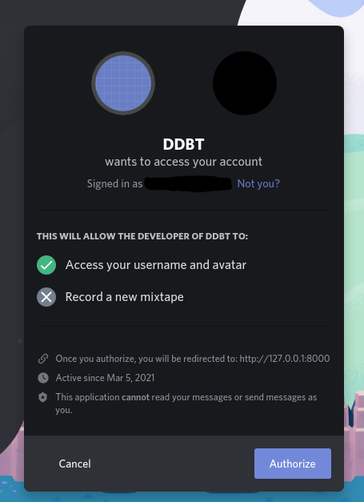
* Transcripts (Chat Logging)
  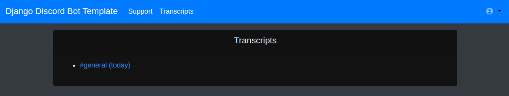
  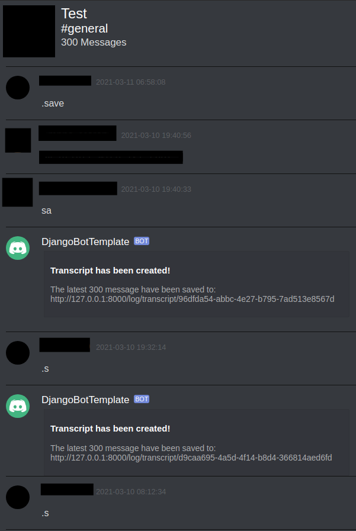
* Simple Support Panel
  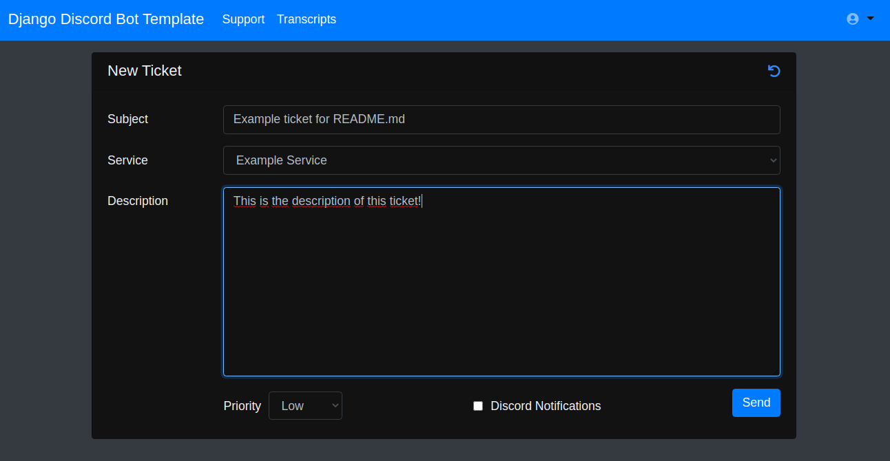
  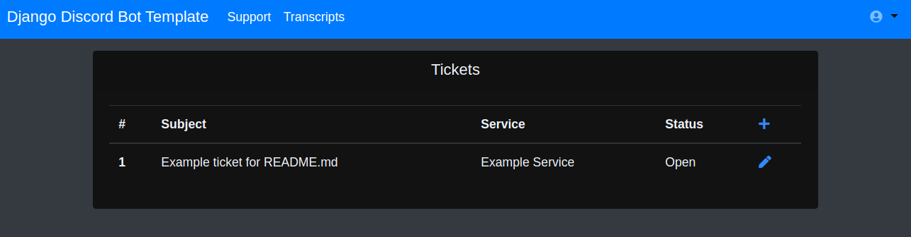

## Development Setup
1. Create the sqlite3 database and load the fixture (default settings for the discord bot):
```
python3 app/manage.py migrate
python3 app/manage.py loaddata app/base_app/fixtures/settings
```
2. Open the [Discord Developer Portal](https://discord.com/developers)
3. Click on the 'New Application' button and give the bot a name:
   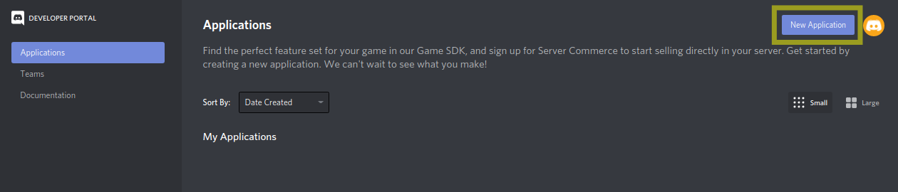
4. Now open the Bot settings:
   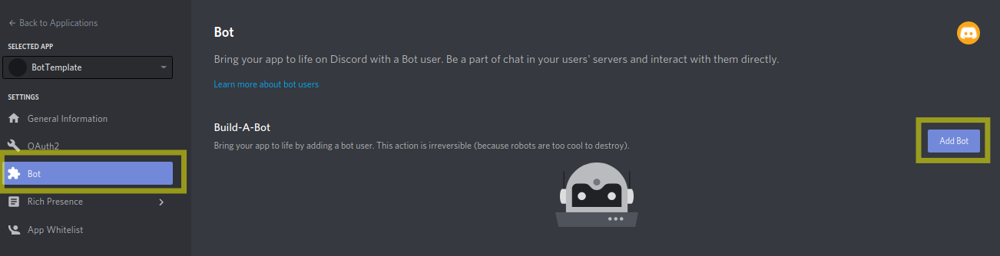
5. Copy your bot token and export it as `DISCORD_BOT_TOKEN` environment variable:
   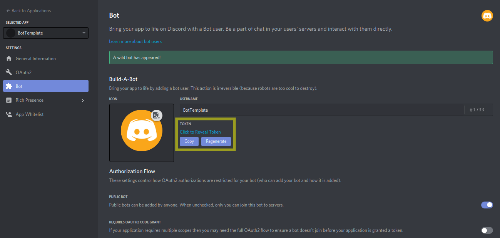
6. Don't forget to enable `Privileged Gateway Intents` (right below the `Authorization Flows` in the bot settings):
   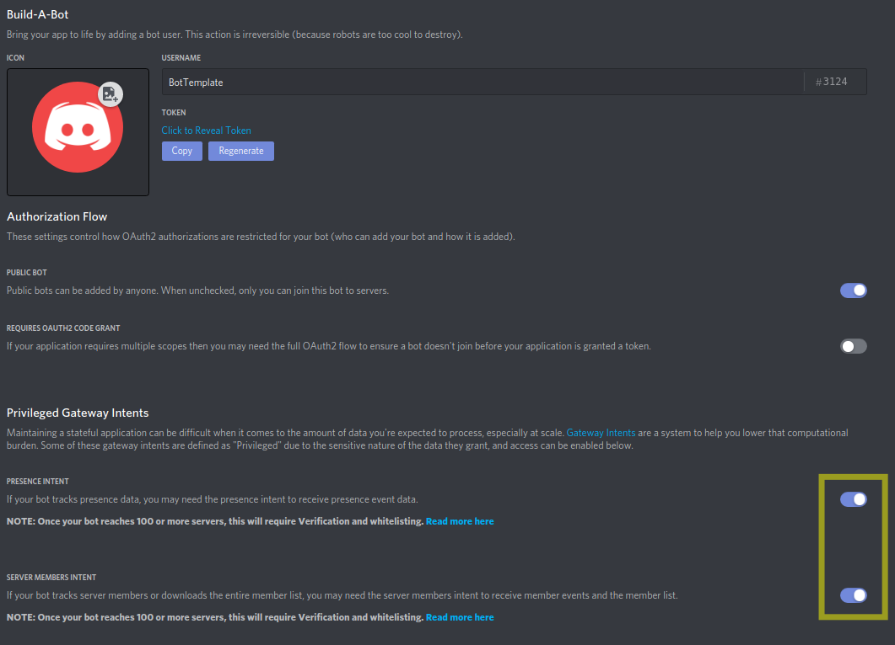
7. Add the bot to your discord server
   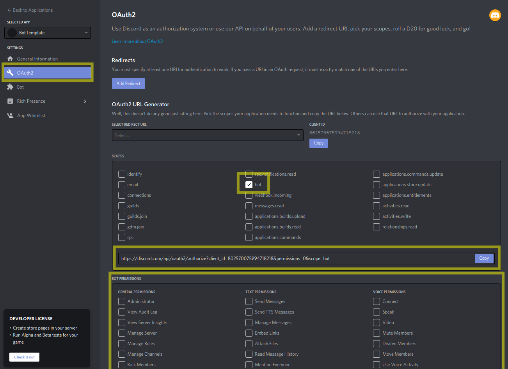
8. Copy client id (environment variable `OAUTH_CLIENT_ID`) and client secret (environment variable `OAUTH_CLIENT_SECRET`)
   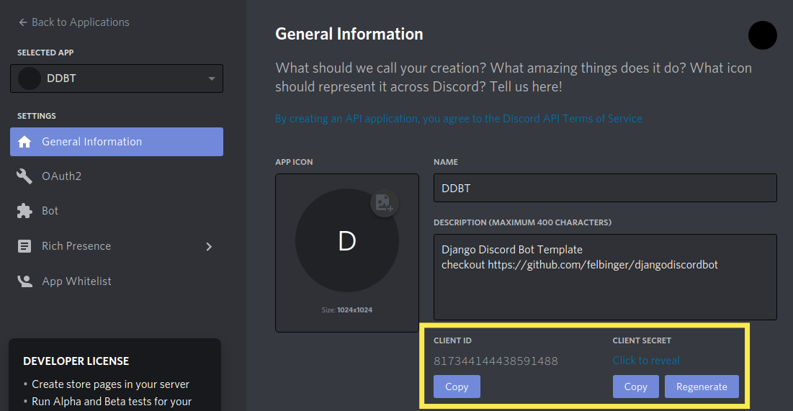
9. Create OAuth2 redirect (if you would like to deploy the bot, you need to change 127.0.0.1:8000 to the public url)
   and export the generated url (don't forget to enable identify scope) as environment variable `OAUTH_URL`.
   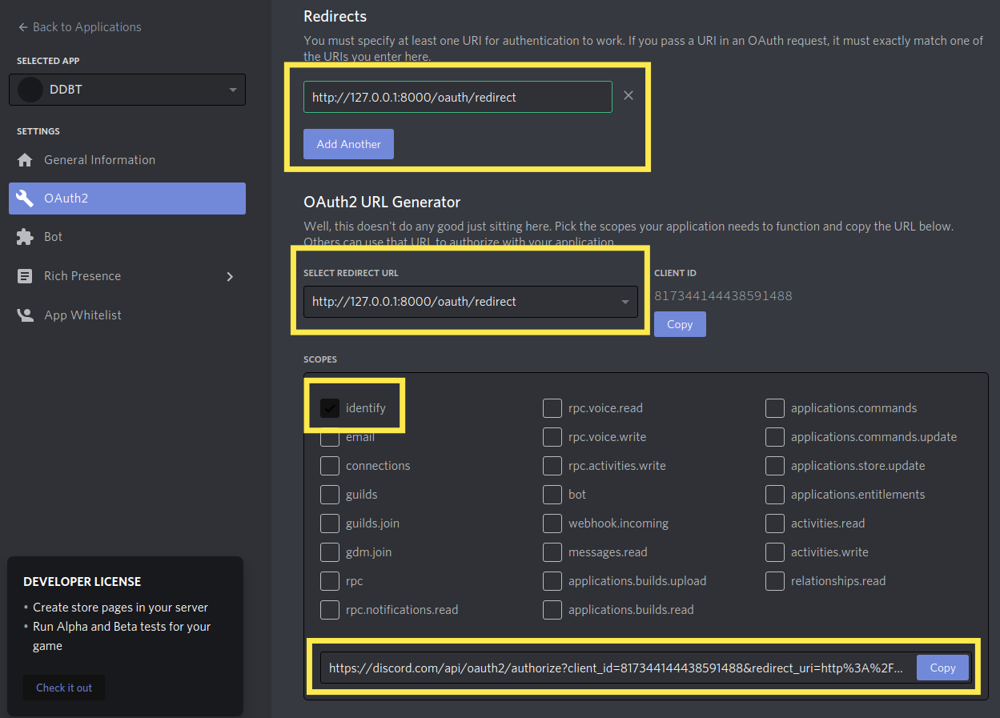

## Productive Setup
1. Install [docker](https://docs.docker.com/engine/install/)
2. Install [docker-compose](https://docs.docker.com/compose/install/)  
3. Adjust the environment variables in [`docker-compose.yml`](./docker-compose.yml)  
   Checkout the development setup for detailed explanation on how to generate these values. 
4. Start the services 
   ```shell
   docker-compose up -d
   ```
5. Collect static files (to be served using nginx):
   ```shell
   # collect static files
   docker-compose exec -u0 django /bin/sh -c 'python manage.py collectstatic --no-input'
   ```
6. Create Superuser:
   You can make your discord user, superuser. Afterwards you can delete the created user in the django admin.
   ```shell
   # create superuser
   docker-compose exec django /bin/sh -c 'python manage.py createsuperuser --username=admin'
   ```

Afterwards you can access the application: [http://localhost:8080](http://localhost:8080)  
You can change the port inside the [`docker-compose.yml`](./docker-compose.yml#L29)
