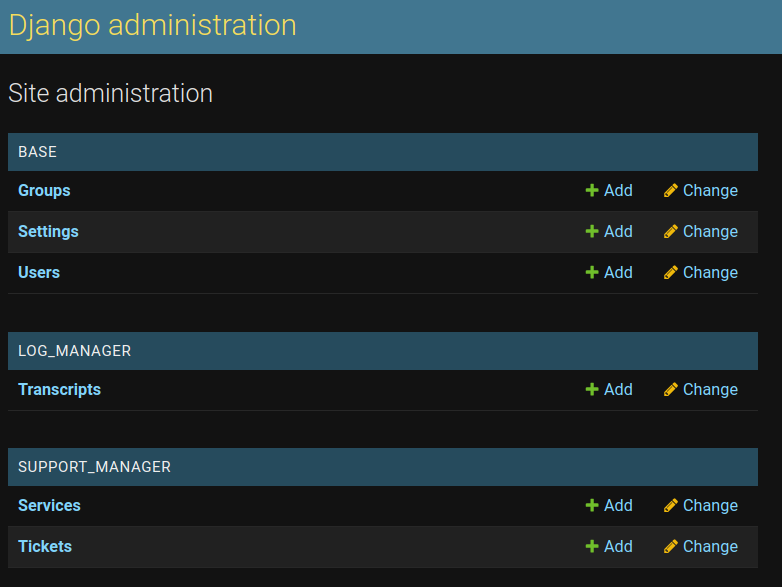

# Django Discord Bot Template
This template offers a discord bot ([discordpy](https://discordpy.readthedocs.io/)) inside a [django](https://www.djangoproject.com/) application.
You can easily connect features between these two frameworks, I created a simple support panel, and a transcript feature.

Feel free to open issues and pull requests.
Unfortunately I don't have much time to work on this project.

Thanks to [@Paul-Brauckmann](https://github.com/Paul-Brauckmann) for the great idea to combine a Discord bot with a Django application.

## Setup Instructions
* [Productive Setup](resources/docs/prod_setup.md)
* [Development Setup](resources/docs/dev_setup.md)

## Features
* Sign on with Discord  
  
  
* Django Admin
  
  
* Simple Support Panel  
    
  
  
* Transcripts (Chat Logging)  
    
  